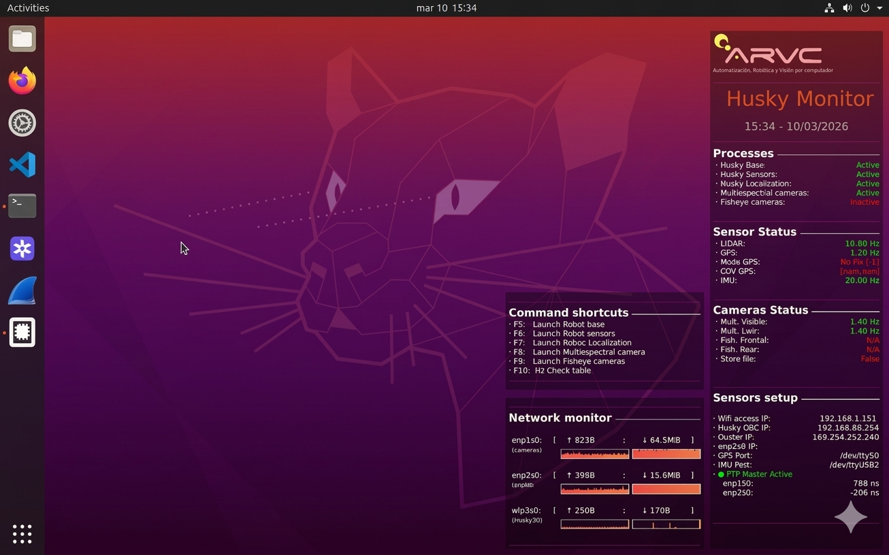

# Husky Test Utils

Operational infrastructure for the Clearpath Husky UGV: shell environment setup, desktop monitoring (Conky), systemd service definitions, GPS tools, and URDF extras.

## Overview

| Directory | Description |
|-----------|-------------|
| [scripts/](scripts/) | Shell functions: ROS workspace setup, hardware IP exports, F-key shortcuts, Conky launcher |
| [monitor/](monitor/) | 3 Conky desktop widgets: process status, sensor data, network traffic |
| [systemctl_services/](systemctl_services/) | 12 systemd service files managing the full robot software stack |
| [python/](python/) | GPS trajectory parser/visualizer and Harxon antenna serial configuration GUI |
| [urdf/](urdf/) | Extra URDF frames (LIDAR + GPS) for the Husky description |
| [rviz/](rviz/) | Preconfigured RViz layout for map visualization |

## Shell Environment

The entry point is `husky_setup.sh`, sourced from `~/.bashrc`. It sets up the full ROS environment and provides user-facing functions:

| Function | Action |
|----------|--------|
| `husky_ros_setup` | Source catkin workspace, export `ROS_MASTER_URI`, mount data disk, set hardware IPs |
| `husky_launch_base` | Restart `husky_base.service` (motors/teleop/odom) |
| `husky_launch_sensors` | Sync LIDAR PTP, restart `sensors.service` (LIDAR + GPS + IMU + DHT22) |
| `husky_launch_localization` | Restart `localization.service` (dual EKF + NavSat) |
| `husky_launch_multiespectral_camera` | Launch multiespectral cameras |
| `husky_launch_fisheye_cameras` | Launch fisheye cameras |
| `husky_check_sensors` | Run `check_sensors.py` — live frequency table |
| `husky_multiespectral_start_store` | Enable recording via ROS topic |
| `husky_multiespectral_stop_store` | Disable recording |

**F-key shortcuts** (bound in terminal): F5=base, F6=sensors, F7=localization, F8=multiespectral, F9=fisheye, F10=sensor check.

## Conky Desktop Monitor

Three desktop widgets providing at-a-glance system status:

| Widget | File | Position | Content |
|--------|------|----------|---------|
| **Main** | `monitor/conkyrc` | Top-right (full height) | ARVC logo, process status (5 services), sensor readings, camera status, hardware IPs, PTP offsets |
| **Shortcuts** | `monitor/conkyrc_command` | Bottom-left column | F-key reference card |
| **Network** | `monitor/conkyrc_network` | Bottom-left column | Per-interface (enp1s0/enp2s0/wlp3s0) upload/download speed with graphs |

Process status and sensor readings are generated by Lua scripts (`main.lua` → `check_processes.lua` + `process_txt.lua`) that parse live data from `check_sensors.py` output files.

<p align="center">
  
</p>

## Systemd Services

Boot order and dependencies:

```
ptp_cameras_lidar → ptp_phc2sys → roscore → husky_base
                                          → sensors → localization
                                          → husky_web_manager → multiespectral_gui
                                                               → fisheye_gui
                                          → conky
```

| Service | Description |
|---------|-------------|
| `ptp_cameras_lidar` | IEEE 1588 PTP master (`ptp4l`) |
| `ptp_phc2sys` | Sync NIC PHCs to CLOCK_REALTIME (`phc2sys` for enp1s0 + enp2s0) |
| `roscore` | ROS Master |
| `husky_base` | Husky drivers (motors, teleop, wheel odometry) |
| `sensors` | LIDAR + GPS + IMU + DHT22 via `sensors_manager.launch` |
| `localization` | Dual EKF + NavSat via `localization_manager.launch` |
| `multiespectral_cameras` | Visible + LWIR cameras (manual start) |
| `fisheye_cameras` | Front + rear fisheye Baslers (manual start) |
| `husky_web_manager` | Flask monitoring dashboard on port 5050 |
| `multiespectral_gui` | Multiespectral camera GUI on port 5051 |
| `fisheye_gui` | Fisheye camera GUI on port 5052 |
| `conky` | Desktop monitoring widgets |

See [systemctl_services/README.md](systemctl_services/README.md) for symlink and enable commands.

## Python Utilities

| Script | Description |
|--------|-------------|
| `gps_parser_map.py` | Parse `rostopic echo /gnss/fix` dumps, compute haversine distances, project GPS trajectories with error ellipses onto a map image |
| `gui_antena_config_qt.py` | PyQt6 serial GUI for Harxon TS100 Smart Antenna — send $CFG commands, configure NMEA rates, set base station position |
| `gui_antena_config.py` | Tkinter version of the antenna config GUI |

See [python/README.md](python/README.md) for usage.

<p align="center">
  
  
</p>

## URDF

`husky_extras.urdf.xacro` — adds fixed-joint sensor frames to the Husky TF tree:
- `os_sensor` (Ouster LIDAR) at `[-0.075, 0, 0.58]` relative to `top_plate_link`
- `gps_link` (GPS antenna) at `[0.08, 0, 0.245]` relative to `top_plate_front_link`

## Related Repositories

| Repository | Relation |
|------------|----------|
| [husky_manager](https://github.com/enheragu/husky_manager) | Launch files, web dashboard (port 5050), sensor checker — managed by the systemd services defined here |
| [multiespectral_acquire](https://github.com/enheragu/multiespectral_acquire) | Camera drivers, buffer sync pipeline, and camera GUIs — launched by `multiespectral_cameras` and `fisheye_cameras` services |
