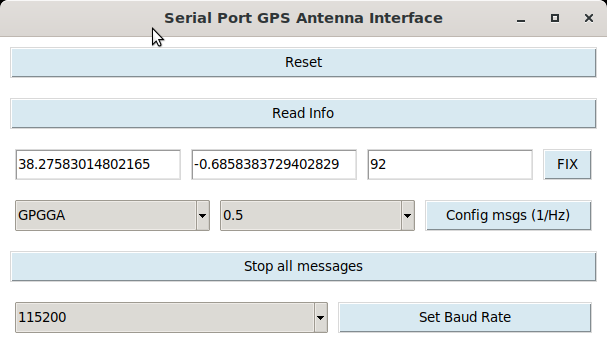
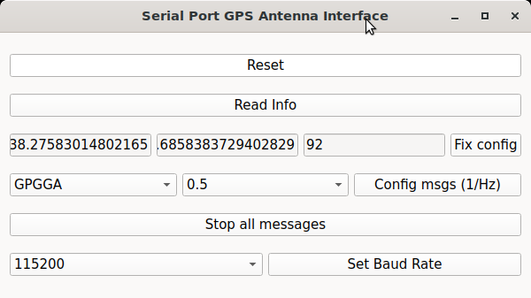

# Python Utilities

Scripts for GPS data processing and Harxon TS100 Smart Antenna serial configuration.

## Dependencies

```sh
xargs sudo apt-get install < requirements
```

## Scripts

### gps_parser_map.py

Parses GPS topic data (from `rostopic echo /gnss/fix` dumps), computes haversine distances between points, and projects trajectories with covariance-based error ellipses onto a map image.

### gui_antena_config.py / gui_antena_config_qt.py

Serial GUI for configuring the Harxon TS100 Smart Antenna: send `$CFG` commands, set NMEA output rates, and configure base station coordinates (latitude, longitude, altitude).

Two versions are available: Tkinter and PyQt6.

```sh
./gui_antena_config.py [-p PORT] [-b BAUDRATE]
./gui_antena_config_qt.py [-p PORT] [-b BAUDRATE]
```

| Argument | Default | Description |
|----------|---------|-------------|
| `-p PORT` | `/dev/ttyUSB0` | Serial port for the antenna |
| `-b BAUDRATE` | `115200` | Communication baud rate |

<p align="center">
  
  
</p>
